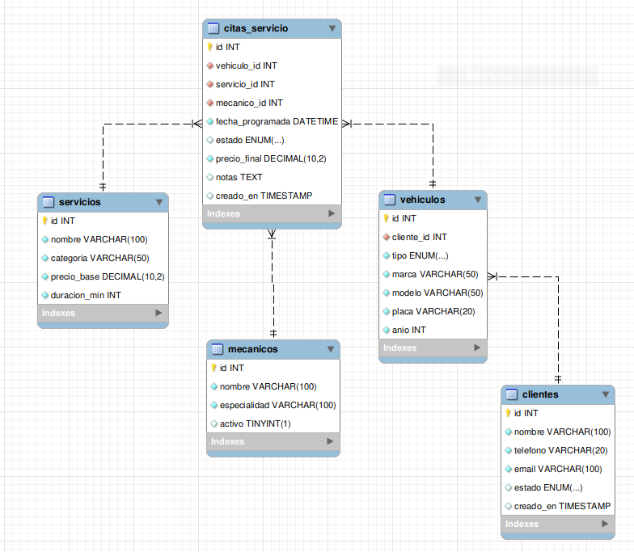

# GARAGE ELITE CAMPUS

Sistema de gestión de talleres mecánicos especializados en vehículos de alta gama (motos, autos de lujo e hiperdeportivos).

## Descripción del Proyecto

Garage Elite Campus es un sistema desarrollado como ejercicio de comprensión sobre el tema de CRUD con procedimientos almacenados en MySQL. El proyecto convierte una solicitud de cliente en tablas relacionales y crea procedimientos almacenados para un CRUD completo, incluyendo validaciones, transacciones, errores controlados y evidencias de ejecución.

### Objetivo

- Convertir una solicitud de cliente en tablas relacionales
- Crear procedimientos almacenados para un CRUD completo
- Implementar validaciones y errores controlados
- Generar evidencias de ejecución en MySQL

## Tecnologías Utilizadas

- **Base de Datos:** MySQL
- **Lenguaje:** SQL (DDL, DML, DQL, Procedimientos Almacenados)
- **Herramientas:** Visual SC, MySQL Workbench y phpMyAdmin

## Estructura del Proyecto

```
garage-elite-campus/
├── intermedio/ejercicio-clase-crud-procedimientos/resoluciones/jakelin-quino/
|    ├── analisis/
|    │   └── requerimiento.md          # Análisis de requerimientos del cliente
|    ├── ddl/
|    │   └── schema.sql                # Estructura de tablas (DDL)
|    ├── dml/
|    │   └── inserts.sql               # Datos de prueba (DML)
|    ├── dql/
|    │   └── consultas.sql             # Consultas de análisis (DQL)
|    ├── procedures/
|    │   └── crud_citas.sql            # Procedimientos almacenados (CRUD)
|    ├── evidencias/
|    │   ├── diagramaEER.png           # Diagrama Entidad-Relación
|    │   ├── data_clientes.png         # Vista de datos de clientes
|    │   ├── data_vehiculos.png        # Vista de datos de vehículos
|    │   ├── data_mecanicos.png        # Vista de datos de mecánicos
|    │   ├── data_servicios.png        # Vista de datos de servicios
|    │   ├── data_citas_servicios.png  # Vista de datos de citas
|    │   ├── procedimientos.png        # Creación de procedimientos
|    │   ├── consulta1.png             # Resultado consulta 1
|    │   ├── consulta2.png             # Resultado consulta 2
|    │   ├── consulta3.png             # Resultado consulta 3
|    │   ├── consulta4.png             # Resultado consulta 4
|    │   └── consulta5.png             # Resultado consulta 5
|    ├── README.md                     # Estructura de la Base de Datos
|    └── resultados.md                 # Pruebas de Procedimientos Almacenados (CALL)
└── README.md                         # Este archivo
```

## Modelo de Datos

### Diagrama Entidad-Relación (EER)



### Tablas del Sistema

| Tabla | Descripción | Campos Principales |
|-------|-------------|-------------------|
| `clientes` | Información de clientes | id, nombre, teléfono, email, estado |
| `vehiculos` | Vehículos de los clientes | id, cliente_id, tipo, marca, modelo, placa, año |
| `mecanicos` | Personal técnico | id, nombre, especialidad, activo |
| `servicios` | Servicios ofrecidos | id, nombre, categoría, precio_base, duración_min |
| `citas_servicio` | Registro de citas | id, vehiculo_id, servicio_id, mecanico_id, fecha_programada, estado, precio_final, notas |

### Relaciones Clave

- Un **cliente** puede tener múltiples **vehículos** (1:N)
- Un **vehículo** puede tener múltiples **citas** (1:N)
- Un **mecánico** puede atender múltiples **citas** (1:N)
- Un **servicio** puede estar en múltiples **citas** (1:N)

## Características Principales

### CRUD Completo con Procedimientos Almacenados

| Operación | Procedimiento | Descripción |
|-----------|---------------|-------------|
| **CREATE** | `sp_crear_cita_servicio` | Crea una nueva cita con validaciones |
| **READ** | `sp_listar_citas_servicio` | Lista citas con filtro por estado |
| **UPDATE** | `sp_actualizar_cita_servicio` | Actualiza datos de una cita existente |
| **DELETE (Soft)** | `sp_cancelar_cita_servicio` | Cancela una cita (soft delete) |
| **DELETE (Hard)** | `sp_eliminar_cita_borrador` | Elimina físicamente una cita pendiente |

### Validaciones Implementadas

1. **Precio final negativo** - Rechaza la operación
2. **Fecha programada nula** - Rechaza la operación
3. **Mecánico inactivo** - Rechaza la operación
4. **Mecánico inexistente** - Rechaza la operación
5. **Cita cancelada** - Rechaza modificaciones
6. **Estado no permitido** - Rechaza la operación
7. **Cita completada** - Rechaza cancelación
8. **Cita no pendiente** - Rechaza eliminación física

### Consultas de Análisis (DQL)

1. **Citas pendientes** - Listado ordenado por fecha
2. **Total recaudado** - Agrupado por estado de cita
3. **Ranking de mecánicos** - Por cantidad de citas atendidas
4. **Vehículos frecuentes** - Con más de una cita registrada
5. **Servicios más solicitados** - Con promedio de precio cobrado

## Datos de Prueba

### Clientes Registrados

| Nombre | Teléfono | Email |
|--------|----------|-------|
| Carlos Sainz | 34600112 | carlos.sainz@gmail.com |
| Valentino Rossi | 39066987 | vale46@gmail.com |
| Lewis Hamilton | 44207946 | lewis44@gmail.com |
| Marc Márquez | 34611223 | marc93@gmail.com |
| Charles López | 77931528 | charles16@gmail.com |

### Mecánicos Especializados

| Nombre | Especialidad | Estado |
|--------|--------------|--------|
| Mateo Rossi | Motos de Alta Cilindrada | Activo |
| Andrés Gómez | Autos de Lujo y Motores V12 | Activo |
| Sofia Chen | Telemetría e Hiperdeportivos | Activo |
| Lucas Silva | Suspensiones y Frenos Pista | Inactivo |

### Servicios Ofrecidos

| Nombre | Categoría | Precio Base | Duración (min) |
|--------|-----------|-------------|----------------|
| Mantenimiento Preventivo Básico | General | 150.00 | 60 |
| Calibración Telemetría Pista | Alto Rendimiento | 850.00 | 120 |
| Revisión y Aseo Carbocerámico | Frenos | 450.00 | 90 |
| Ajuste Fino Motor V12 / V10 | Motor | 1200.00 | 240 |
| Service Oficial Superbike | Moto GP/Track | 500.00 | 180 |

## Resultados y Evidencias

Las evidencias de ejecución se encuentran en la carpeta `evidencias/` y muestran:

- Estructura de todas las tablas con datos
- Resultados de las 5 consultas de análisis
- Creación exitosa de procedimientos almacenados
- Validaciones funcionando correctamente

Para ver la documentación detallada de resultados, consulta el archivo [resultados.md](resultados.md).

## Manejo de Errores

El sistema utiliza `SIGNAL SQLSTATE` para manejar errores controlados:

```sql
-- Ejemplo de error por precio negativo
Error Code: 1644, Error: El precio final no puede ser negativo.

-- Ejemplo de error por mecánico inactivo
Error Code: 1644, Error: El mecánico asignado se encuentra inactivo.
```

---

**Fecha:** Agosto 2026  
