# GARAGE ELITE CAMPUS 

## Estructura de la Base de Datos

### Vistas de Datos

#### Tabla clientes
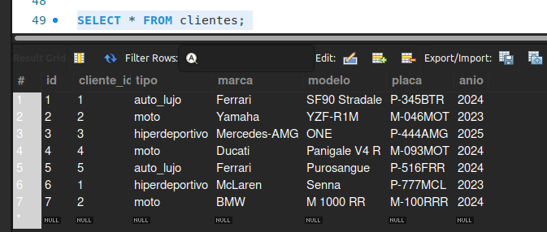

#### Tabla vehiculos
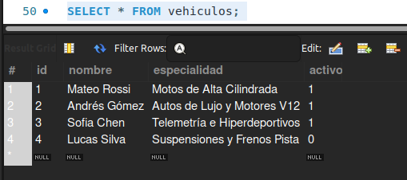

#### Tabla mecanicos
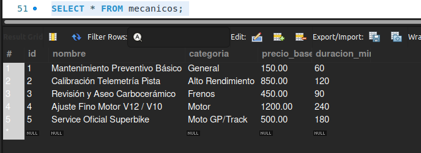

#### Tabla servicios
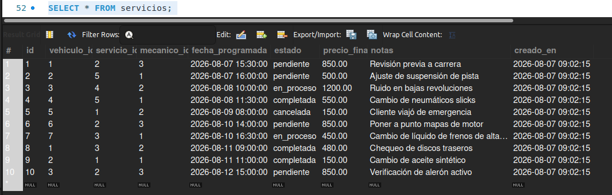

#### Tabla citas_servicio
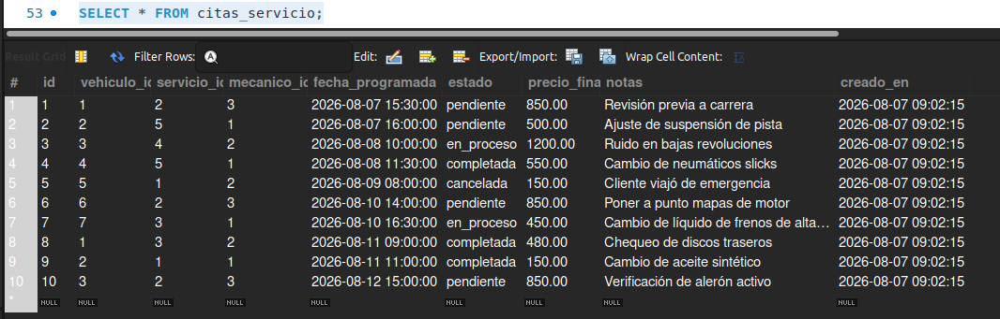

---

## Scripts de la Base de Datos

### DDL - Estructura de Tablas

```sql
-- Eliminar base de datos y tablas si existen
DROP DATABASE IF EXISTS garage_elite_campus;
DROP TABLE IF EXISTS citas_servicio;
DROP TABLE IF EXISTS servicios;
DROP TABLE IF EXISTS mecanicos;
DROP TABLE IF EXISTS vehiculos;
DROP TABLE IF EXISTS clientes;

-- 1. Crear y seleccionar la base de datos
CREATE DATABASE IF NOT EXISTS garage_elite_campus;
USE garage_elite_campus;

-- 2. Tabla de Clientes
CREATE TABLE clientes (
    id INT AUTO_INCREMENT PRIMARY KEY,
    nombre VARCHAR(100) NOT NULL,
    telefono VARCHAR(20) NOT NULL,
    email VARCHAR(100) NOT NULL UNIQUE,
    estado ENUM('activo', 'inactivo') DEFAULT 'activo',
    creado_en TIMESTAMP DEFAULT CURRENT_TIMESTAMP
) ENGINE=InnoDB;

-- 3. Tabla de Vehiculos
CREATE TABLE vehiculos (
    id INT AUTO_INCREMENT PRIMARY KEY,
    cliente_id INT NOT NULL,
    tipo ENUM('moto', 'auto_lujo', 'hiperdeportivo') NOT NULL,
    marca VARCHAR(50) NOT NULL,
    modelo VARCHAR(50) NOT NULL,
    placa VARCHAR(10) NOT NULL UNIQUE,
    anio INT NOT NULL,
    FOREIGN KEY (cliente_id) REFERENCES clientes(id)
) ENGINE=InnoDB;

-- 4. Tabla de Mecanicos
CREATE TABLE mecanicos (
    id INT AUTO_INCREMENT PRIMARY KEY,
    nombre VARCHAR(100) NOT NULL,
    especialidad VARCHAR(100) NOT NULL,
    activo BOOLEAN DEFAULT 1
) ENGINE=InnoDB;

-- 5. Tabla de Servicios
CREATE TABLE servicios (
    id INT AUTO_INCREMENT PRIMARY KEY,
    nombre VARCHAR(100) NOT NULL,
    categoria VARCHAR(50) NOT NULL,
    precio_base DECIMAL(10,2) NOT NULL,
    duracion_min INT NOT NULL
) ENGINE=InnoDB;

-- 6. Tabla de Citas de Servicio
CREATE TABLE citas_servicio (
    id INT AUTO_INCREMENT PRIMARY KEY,
    vehiculo_id INT NOT NULL,
    servicio_id INT NOT NULL,
    mecanico_id INT NOT NULL,
    fecha_programada DATETIME NOT NULL,
    estado ENUM('pendiente', 'en_proceso', 'completada', 'cancelada') DEFAULT 'pendiente',
    precio_final DECIMAL(10,2) NOT NULL,
    notas TEXT,
    creado_en TIMESTAMP DEFAULT CURRENT_TIMESTAMP,
    FOREIGN KEY (vehiculo_id) REFERENCES vehiculos(id),
    FOREIGN KEY (servicio_id) REFERENCES servicios(id),
    FOREIGN KEY (mecanico_id) REFERENCES mecanicos(id)
) ENGINE=InnoDB;
```

### DML - Datos de Prueba

```sql
USE garage_elite_campus;

-- Insertar Clientes
INSERT INTO clientes (nombre, telefono, email) VALUES
('Carlos Sainz', '34600112', 'carlos.sainz@gmail.com'),
('Valentino Rossi', '39066987', 'vale46@gmail.com'),
('Lewis Hamilton', '44207946', 'lewis44@gmail.com'),
('Marc Marquez', '34611223', 'marc93@gmail.com'),
('Charles Lopez', '77931528', 'charles16@gmail.com');

-- Insertar Vehiculos
INSERT INTO vehiculos (cliente_id, tipo, marca, modelo, placa, anio) VALUES
(1, 'auto_lujo', 'Ferrari', 'SF90 Stradale', 'P-345BTR', 2024),
(2, 'moto', 'Yamaha', 'YZF-R1M', 'M-046MOT', 2023),
(3, 'hiperdeportivo', 'Mercedes-AMG', 'ONE', 'P-444AMG', 2025),
(4, 'moto', 'Ducati', 'Panigale V4 R', 'M-093MOT', 2024),
(5, 'auto_lujo', 'Ferrari', 'Purosangue', 'P-516FRR', 2024),
(1, 'hiperdeportivo', 'McLaren', 'Senna', 'P-777MCL', 2023),
(2, 'moto', 'BMW', 'M 1000 RR', 'M-100RRR', 2024);

-- Insertar Mecanicos
INSERT INTO mecanicos (nombre, especialidad, activo) VALUES
('Mateo Rossi', 'Motos de Alta Cilindrada', 1),
('Andres Gomez', 'Autos de Lujo y Motores V12', 1),
('Sofia Chen', 'Telemetria e Hiperdeportivos', 1),
('Lucas Silva', 'Suspensiones y Frenos Pista', 0);

-- Insertar Servicios
INSERT INTO servicios (nombre, categoria, precio_base, duracion_min) VALUES
('Mantenimiento Preventivo Basico', 'General', 150.00, 60),
('Calibracion Telemetria Pista', 'Alto Rendimiento', 850.00, 120),
('Revision y Aseo Carboceramico', 'Frenos', 450.00, 90),
('Ajuste Fino Motor V12 / V10', 'Motor', 1200.00, 240),
('Service Oficial Superbike', 'Moto GP/Track', 500.00, 180);

-- Insertar Citas Iniciales
INSERT INTO citas_servicio (vehiculo_id, servicio_id, mecanico_id, fecha_programada, estado, precio_final, notas) VALUES
(1, 2, 3, '2026-08-07 15:30:00', 'pendiente', 850.00, 'Revision previa a carrera'),
(2, 5, 1, '2026-08-07 16:00:00', 'pendiente', 500.00, 'Ajuste de suspension de pista'),
(3, 4, 2, '2026-08-08 10:00:00', 'en_proceso', 1200.00, 'Ruido en bajas revoluciones'),
(4, 5, 1, '2026-08-08 11:30:00', 'completada', 550.00, 'Cambio de neumaticos slicks'),
(5, 1, 2, '2026-08-09 08:00:00', 'cancelada', 150.00, 'Cliente viajo de emergencia'),
(6, 2, 3, '2026-08-10 14:00:00', 'pendiente', 850.00, 'Poner a punto mapas de motor'),
(7, 3, 1, '2026-08-10 16:30:00', 'en_proceso', 450.00, 'Cambio de liquido de frenos de alta ebullicion'),
(1, 3, 2, '2026-08-11 09:00:00', 'completada', 480.00, 'Chequeo de discos traseros'),
(2, 1, 1, '2026-08-11 11:00:00', 'completada', 150.00, 'Cambio de aceite sintetico'),
(3, 2, 3, '2026-08-12 15:00:00', 'pendiente', 850.00, 'Verificacion de aleron activo');
```

---

## Consultas DQL - Analisis de Datos

### Consulta 1: Citas Pendientes Ordenadas por Fecha

```sql
SELECT c.id, cl.nombre AS cliente, v.placa, c.fecha_programada, c.estado 
FROM citas_servicio c
JOIN vehiculos v ON c.vehiculo_id = v.id
JOIN clientes cl ON v.cliente_id = cl.id
WHERE c.estado = 'pendiente'
ORDER BY c.fecha_programada ASC;
```

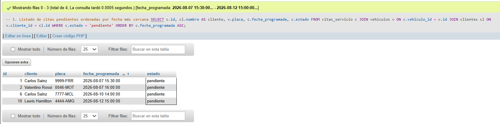

### Consulta 2: Total Recaudado por Estado de Cita

```sql
SELECT estado, COUNT(*) AS cantidad_citas, SUM(precio_final) AS total_recaudado
FROM citas_servicio
GROUP BY estado;
```

**Resultados:**

| estado | cantidad_citas | total_recaudado |
|--------|---------------|-----------------|
| pendiente | 4 | 3050.00 |
| en_proceso | 2 | 1650.00 |
| completada | 3 | 1180.00 |
| cancelada | 1 | 150.00 |

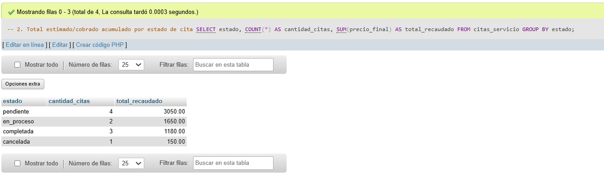

### Consulta 3: Ranking de Mecanicos por Citas Atendidas

```sql
SELECT m.nombre, m.especialidad, COUNT(c.id) AS total_atendidas
FROM mecanicos m
LEFT JOIN citas_servicio c ON m.id = c.mecanico_id AND c.estado IN ('en_proceso', 'completada')
GROUP BY m.id, m.nombre, m.especialidad
ORDER BY total_atendidas DESC;
```

**Resultados:**

| nombre | especialidad | total_atendidas |
|--------|--------------|-----------------|
| Mateo Rossi | Motos de Alta Cilindrada | 3 |
| Andres Gomez | Autos de Lujo y Motores V12 | 2 |
| Sofia Chen | Telemetria e Hiperdeportivos | 0 |
| Lucas Silva | Suspensiones y Frenos Pista | 0 |

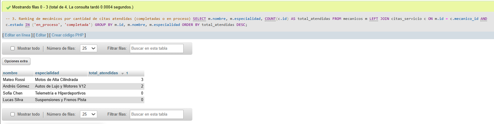

### Consulta 4: Vehiculos con Mas de Una Cita

```sql
SELECT v.placa, v.marca, v.modelo, COUNT(c.id) AS total_citas
FROM vehiculos v
JOIN citas_servicio c ON v.id = c.vehiculo_id
GROUP BY v.id, v.placa, v.marca, v.modelo
HAVING COUNT(c.id) > 1;
```

**Resultados:**

| placa | marca | modelo | total_citas |
|-------|-------|--------|-------------|
| P-345BTR | Ferrari | SF90 Stradale | 2 |
| M-046MOT | Yamaha | YZF-R1M | 2 |
| P-444AMG | Mercedes-AMG | ONE | 2 |

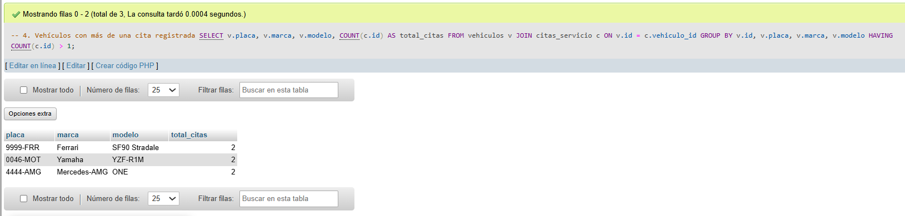

### Consulta 5: Servicios Mas Solicitados

```sql
SELECT 
    s.nombre, 
    COUNT(c.id) AS veces_solicitado, 
    AVG(c.precio_final) AS precio_promedio
FROM servicios s
JOIN citas_servicio c ON c.servicio_id = s.id
GROUP BY s.id, s.nombre
ORDER BY veces_solicitado DESC;
```

**Resultados:**

| nombre | veces_solicitado | precio_promedio |
|--------|------------------|-----------------|
| Calibracion Telemetria Pista | 3 | 850.000000 |
| Mantenimiento Preventivo Basico | 2 | 150.000000 |
| Revision y Aseo Carboceramico | 2 | 465.000000 |
| Service Oficial Superbike | 2 | 525.000000 |
| Ajuste Fino Motor V12 / V10 | 1 | 1200.000000 |

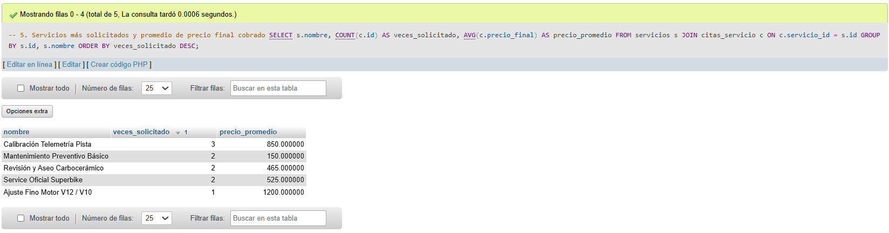

---

## Procedimientos Almacenados (CRUD)

### Creacion de Procedimientos

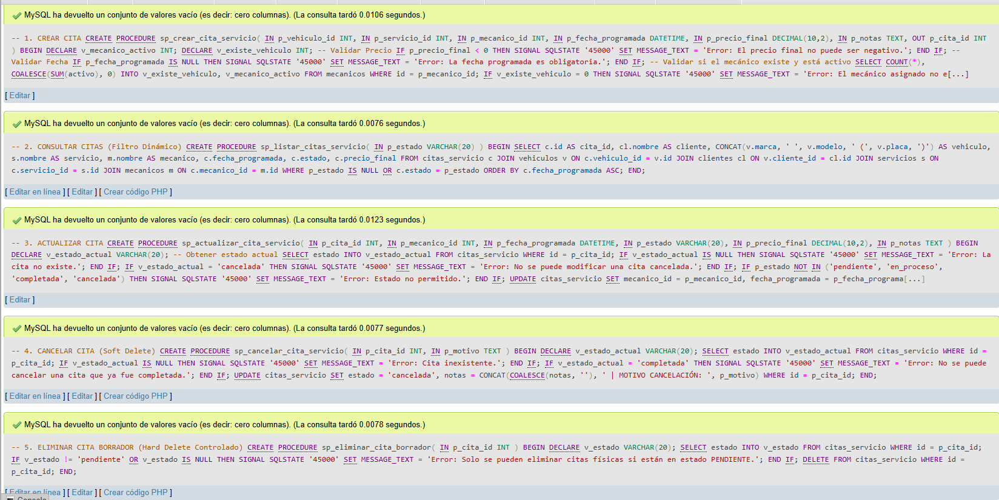

```sql
USE garage_elite_campus;

-- Drop procedimientos previos si existen
DROP PROCEDURE IF EXISTS sp_crear_cita_servicio;
DROP PROCEDURE IF EXISTS sp_listar_citas_servicio;
DROP PROCEDURE IF EXISTS sp_actualizar_cita_servicio;
DROP PROCEDURE IF EXISTS sp_cancelar_cita_servicio;
DROP PROCEDURE IF EXISTS sp_eliminar_cita_borrador;

DELIMITER //
```

### 1. sp_crear_cita_servicio - Crear Cita

**Funcion:** Crea una nueva cita de servicio con validaciones de precio, fecha y disponibilidad del mecanico.

```sql
CREATE PROCEDURE sp_crear_cita_servicio(
    IN p_vehiculo_id INT,
    IN p_servicio_id INT,
    IN p_mecanico_id INT,
    IN p_fecha_programada DATETIME,
    IN p_precio_final DECIMAL(10,2),
    IN p_notas TEXT,
    OUT p_cita_id INT
)
BEGIN
    DECLARE v_mecanico_activo INT;
    DECLARE v_existe_mecanico INT;

    -- Validar Precio
    IF p_precio_final < 0 THEN
        SIGNAL SQLSTATE '45000' SET MESSAGE_TEXT = 'Error: El precio final no puede ser negativo.';
    END IF;

    -- Validar Fecha
    IF p_fecha_programada IS NULL THEN
        SIGNAL SQLSTATE '45000' SET MESSAGE_TEXT = 'Error: La fecha programada es obligatoria.';
    END IF;

    -- Validar si el mecanico existe y esta activo
    SELECT COUNT(*), COALESCE(SUM(activo), 0) INTO v_existe_mecanico, v_mecanico_activo 
    FROM mecanicos WHERE id = p_mecanico_id;

    IF v_existe_mecanico = 0 THEN
        SIGNAL SQLSTATE '45000' SET MESSAGE_TEXT = 'Error: El mecanico asignado no existe.';
    ELSEIF v_mecanico_activo = 0 THEN
        SIGNAL SQLSTATE '45000' SET MESSAGE_TEXT = 'Error: El mecanico asignado se encuentra inactivo.';
    END IF;

    -- Insertar Cita
    INSERT INTO citas_servicio (
        vehiculo_id, servicio_id, mecanico_id, fecha_programada, estado, precio_final, notas
    ) VALUES (
        p_vehiculo_id, p_servicio_id, p_mecanico_id, p_fecha_programada, 'pendiente', p_precio_final, p_notas
    );

    SET p_cita_id = LAST_INSERT_ID();
END //
```

### 2. sp_listar_citas_servicio - Listar Citas

**Funcion:** Lista todas las citas con filtro opcional por estado.

```sql
CREATE PROCEDURE sp_listar_citas_servicio(
    IN p_estado VARCHAR(20)
)
BEGIN
    SELECT 
        c.id AS cita_id,
        cl.nombre AS cliente,
        CONCAT(v.marca, ' ', v.modelo, ' (', v.placa, ')') AS vehiculo,
        s.nombre AS servicio,
        m.nombre AS mecanico,
        c.fecha_programada,
        c.estado,
        c.precio_final
    FROM citas_servicio c
    JOIN vehiculos v ON c.vehiculo_id = v.id
    JOIN clientes cl ON v.cliente_id = cl.id
    JOIN servicios s ON c.servicio_id = s.id
    JOIN mecanicos m ON c.mecanico_id = m.id
    WHERE p_estado IS NULL OR c.estado = p_estado
    ORDER BY c.fecha_programada ASC;
END //
```

### 3. sp_actualizar_cita_servicio - Actualizar Cita

**Funcion:** Actualiza los datos de una cita existente con validaciones de estado.

```sql
CREATE PROCEDURE sp_actualizar_cita_servicio(
    IN p_cita_id INT,
    IN p_mecanico_id INT,
    IN p_fecha_programada DATETIME,
    IN p_estado VARCHAR(20),
    IN p_precio_final DECIMAL(10,2),
    IN p_notas TEXT
)
BEGIN
    DECLARE v_estado_actual VARCHAR(20);

    -- Obtener estado actual
    SELECT estado INTO v_estado_actual FROM citas_servicio WHERE id = p_cita_id;

    IF v_estado_actual IS NULL THEN
        SIGNAL SQLSTATE '45000' SET MESSAGE_TEXT = 'Error: La cita no existe.';
    END IF;

    IF v_estado_actual = 'cancelada' THEN
        SIGNAL SQLSTATE '45000' SET MESSAGE_TEXT = 'Error: No se puede modificar una cita cancelada.';
    END IF;

    IF p_estado NOT IN ('pendiente', 'en_proceso', 'completada', 'cancelada') THEN
        SIGNAL SQLSTATE '45000' SET MESSAGE_TEXT = 'Error: Estado no permitido.';
    END IF;

    UPDATE citas_servicio 
    SET mecanico_id = p_mecanico_id,
        fecha_programada = p_fecha_programada,
        estado = p_estado,
        precio_final = p_precio_final,
        notas = p_notas
    WHERE id = p_cita_id;
END //
```

### 4. sp_cancelar_cita_servicio - Cancelar Cita (Soft Delete)

**Funcion:** Cambia el estado de una cita a "cancelada" y registra el motivo.

```sql
CREATE PROCEDURE sp_cancelar_cita_servicio(
    IN p_cita_id INT,
    IN p_motivo TEXT
)
BEGIN
    DECLARE v_estado_actual VARCHAR(20);

    SELECT estado INTO v_estado_actual FROM citas_servicio WHERE id = p_cita_id;

    IF v_estado_actual IS NULL THEN
        SIGNAL SQLSTATE '45000' SET MESSAGE_TEXT = 'Error: Cita inexistente.';
    END IF;

    IF v_estado_actual = 'completada' THEN
        SIGNAL SQLSTATE '45000' SET MESSAGE_TEXT = 'Error: No se puede cancelar una cita que ya fue completada.';
    END IF;

    UPDATE citas_servicio
    SET estado = 'cancelada',
        notas = CONCAT(COALESCE(notas, ''), ' | MOTIVO CANCELACION: ', p_motivo)
    WHERE id = p_cita_id;
END //
```

### 5. sp_eliminar_cita_borrador - Eliminar Cita

**Funcion:** Elimina fisicamente una cita solo si esta en estado "pendiente".

```sql
CREATE PROCEDURE sp_eliminar_cita_borrador(
    IN p_cita_id INT
)
BEGIN
    DECLARE v_estado VARCHAR(20);

    SELECT estado INTO v_estado FROM citas_servicio WHERE id = p_cita_id;

    IF v_estado != 'pendiente' OR v_estado IS NULL THEN
        SIGNAL SQLSTATE '45000' SET MESSAGE_TEXT = 'Error: Solo se pueden eliminar citas fisicas si estan en estado PENDIENTE.';
    END IF;

    DELETE FROM citas_servicio WHERE id = p_cita_id;
END //

DELIMITER ;
```


## Resumen de Validaciones Implementadas

| Procedimiento | Validacion | Comportamiento |
|--------------|------------|----------------|
| sp_crear_cita_servicio | Precio final negativo | Rechaza la operacion |
| sp_crear_cita_servicio | Fecha programada nula | Rechaza la operacion |
| sp_crear_cita_servicio | Mecanico inactivo | Rechaza la operacion |
| sp_crear_cita_servicio | Mecanico inexistente | Rechaza la operacion |
| sp_actualizar_cita_servicio | Cita cancelada | Rechaza la modificacion |
| sp_actualizar_cita_servicio | Estado no permitido | Rechaza la operacion |
| sp_cancelar_cita_servicio | Cita completada | Rechaza la cancelacion |
| sp_eliminar_cita_borrador | Cita no pendiente | Rechaza la eliminacion |

## Conclusiones

- Todos los procedimientos almacenados funcionan correctamente
- Las validaciones de negocio estan implementadas y funcionan
- El manejo de errores con SIGNAL SQLSTATE es efectivo
- Las consultas DQL generan analisis utiles para la gestion del taller
- El CRUD completo permite una gestion eficiente de citas de servicio
