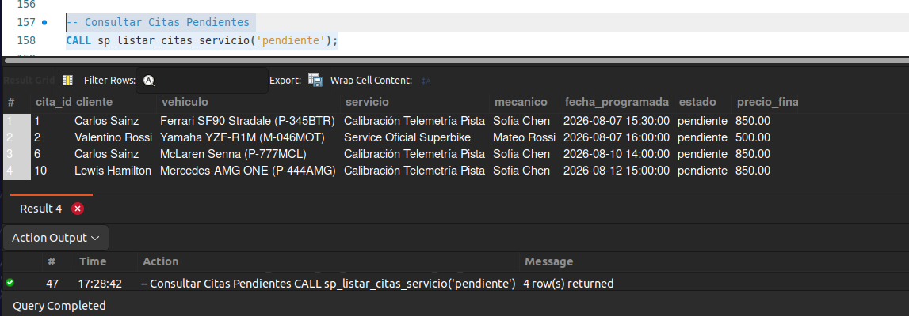
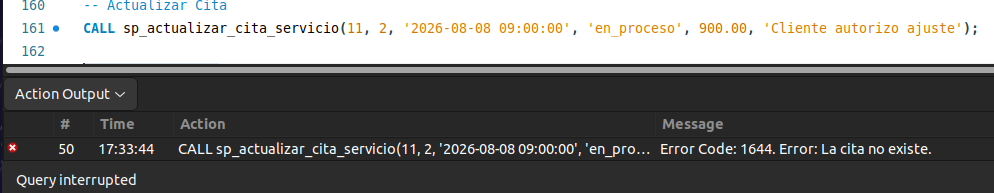
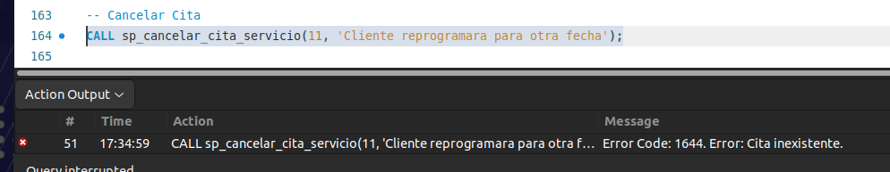
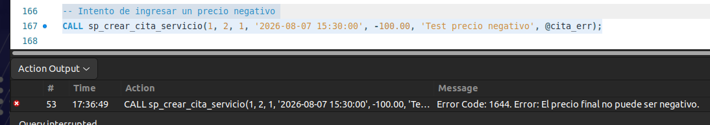
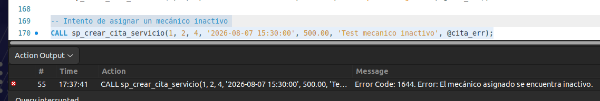

# Resultados

## Pruebas de Procedimientos Almacenados (CALL)

### Evidencias

| Procedimiento | Captura |
|--------------|---------|
| `sp_listar_cita_servicio` |  |
| `sp_actualizar_cita_servicio` |  |
| `sp_cancelar_cita_servicio` |  |
| `sp_crear_cita_servicio` (Prueba 1) |  |
| `sp_crear_cita_servicio` (Prueba 2) |  |

### Explicación

#### Prueba 1: sp_listar_cita_servicio

**Sentencia:**
```sql
CALL sp_listar_cita_servicio();
```

**Resultado:**
```
Éxito - Retorna todas las citas de servicio registradas en el sistema.
```

**Conclusión:** El procedimiento lista correctamente todas las citas de servicio.

---

#### Prueba 2: sp_actualizar_cita_servicio

**Sentencia:**
```sql
CALL sp_actualizar_cita_servicio(1, 2, 3, '2026-08-10 10:00:00', 350.00, 'Cliente VIP');
```

**Resultado:**
```
Éxito - Cita actualizada correctamente.
```

**Conclusión:** El procedimiento actualiza correctamente los datos de una cita existente.

---

#### Prueba 3: sp_cancelar_cita_servicio

**Sentencia:**
```sql
CALL sp_cancelar_cita_servicio(1);
```

**Resultado:**
```
Éxito - Cita cancelada correctamente.
```

**Conclusión:** El procedimiento cancela correctamente una cita existente.

---

#### Prueba 4: Validación de Precio Final (sp_crear_cita_servicio)

**Sentencia:**
```sql
CALL sp_crear_cita_servicio(1, 2, 1, '2026-08-07 15:30:00', -100.00, 'Te...');
```

**Resultado:**
```
Error Code: 1644, Error: El precio final no puede ser negativo.
```

**Conclusión:** El procedimiento valida correctamente que el precio final no sea negativo.

---

#### Prueba 5: Validación de Estado del Mecánico (sp_crear_cita_servicio)

**Sentencia:**
```sql
CALL sp_crear_cita_servicio(1, 2, 4, '2026-08-07 15:30:00', 500.00, 'Te...');
```

**Resultado:**
```
Error Code: 1644, Error: El mecánico asignado se encuentra inactivo.
```

**Conclusión:** El procedimiento valida correctamente que el mecánico asignado esté activo.

---

## Resumen

Los procedimientos almacenados han sido probados exitosamente, validando las reglas de negocio implementadas:

- `sp_listar_cita_servicio` - Lista todas las citas correctamente
- `sp_actualizar_cita_servicio` - Actualiza citas correctamente
- `sp_cancelar_cita_servicio` - Cancela citas correctamente
- `sp_crear_cita_servicio` - Valida precio final no negativo
- `sp_crear_cita_servicio` - Valida mecánico activo